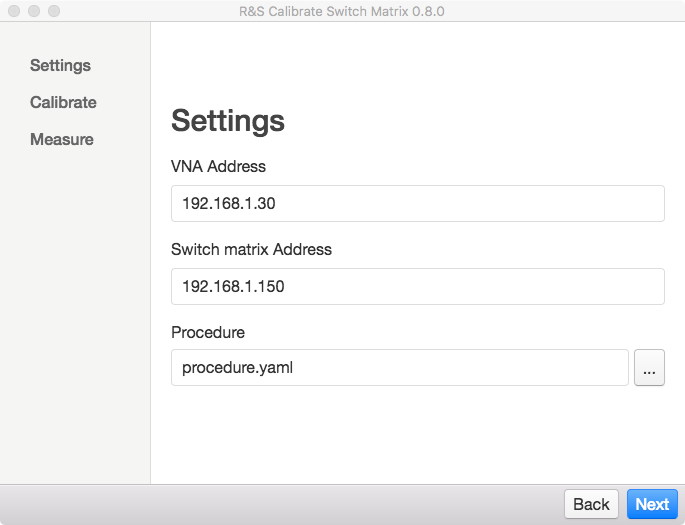
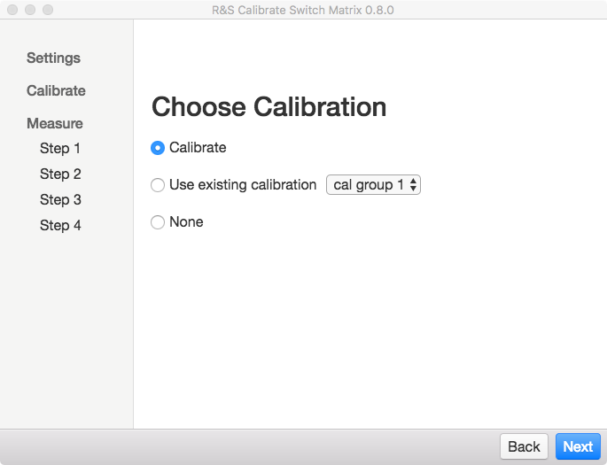
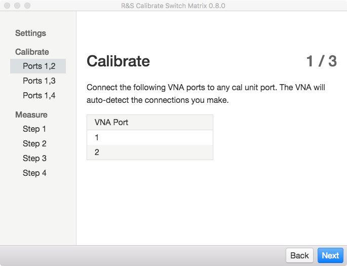
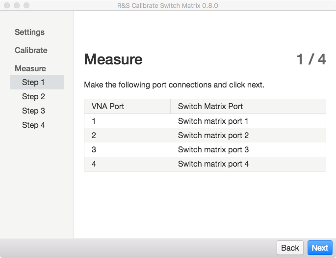

R&S Calibrate Switch Matrix
===========================

R&S Calibrate Switch Matrix is a utility for characterizing the switch matrix in a Rohde & Schwarz rack measurement solution. It uses a Vector Network Analyzer (VNA) to measure RF paths through the switch matrix, generating a touchstone file for each path. These touchstone files can be used to de-embed the effect of the switch matrix on your measurements and tests that utilize the switch matrix

Installation
------------

Note that this application can be installed directly onto a Rohde & Schwarz VNA with Windows 7 or newer.

### Windows

To install, double-click the `R&S Calibrate Switch Matrix x.y.z.exe` installation executable and follow the instructions. A shortcut is created on the desktop and in the start menu.

### Mac

Double-click the `Calibrate Switch Matrix-x.y.z.dmg` file. A `Finder` window opens. Drag the application into the `Applications` folder.

### Linux

This application is written in `Node`, `Python` and cross-platform libraries. Therefore, it can be built for Linux. If you need a Linux version of the application please file a [feature request on Github](https://github.com/Terrabits/calibrate-switch-matrix/issues), contact a Rohde & Schwarz application engineer for assistance or see the build instructions section.

Build Instructions
------------------

This application requires `node` 6.x, `yarn` or `npm`, `python` 3.5.x and `pip`. To install dependencies, run `yarn` or `npm install`. Python dependencies are installed in this step as well.

For more information, see [BUILD.md](https://github.com/Terrabits/calibrate-switch-matrix/blob/master/BUILD.md).

User-created Content
--------------------

This application relies on user-generated procedures and definition files for characterizing a specific switch matrix. These files can be located anywhere as long as they are accessible to the end-user and this application. That said, the suggested location for user-generated content is as follows.

For Windows:

`C:\Users\Public\Documents\Rohde-Schwarz\Calibrate Switch Matrix`

For MacOS:

`/Users/Shared/Rohde-Schwarz/Calibrate Switch Matrix`

Regardless of the absolute location, the directory structure of the procedure files is important. Procedure files themselves are located in the `procedures/` sub-folder. Results are placed into the `results/` sub-folder after measurement.

The other folders around these are required for the procedure to run but can be ignored by the end-user.

This document focuses on using R&S Calibrate Switch Matrix from the user interface. For more details on how to generate procedures see [Generating a procedure for R&S Calibrate Switch Matrix](#). You do not need to know how to generate a procedure file to be able to use an existing procedure with this application.

Hardware Requirements
---------------------

A Rohde & Schwarz VNA and a Rohde & Schwarz measurement system (rack solution) are required. This application must be able to create a TCP socket connection between the computer running this application, the VNA and the switch matrix. This requires TCPIP networking (WiFi, ethernet) between each device. Make a note of the IP address of each device. For on-VNA installations, use the address `localhost`.

Also the procedure files should be compatible with the VNA and switch matrix you are measuring.

How to Use
----------

Start the application. On Windows this can be done from the start menu. On MacOS from the app launcher or the `Applications` folder.

The application should open to the settings page.

### Settings

Input the IP address of the VNA and Switch Matrix. If the application is installed on a VNA the address `localhost` can be used.

Using the open dialog, select the procedure to run. See the `User-created content` section for typical procedure locations.

### Choose Calibration

There are three calibration options:

1. Calibrate

  Calibrate Switch Matrix will configure the VNA for calibration and guide you through each step. See the `Calibrate (optional)` section below for details.

2. Use existing calibration

  If you have already performed and saved a calibration to the VNA you can use this calibration for your measurements. Choose the name of the saved calibration (called a `cal group` in the VNA interface) from the drop-down menu.

3. None

Calibration can be skipped entirely. Note that the results will not be accurate. Skipping calibration is only appropriate for troubleshooting and ballpark estimates. Uncalibrated results will NOT be accurate enough for accurate de-embedding.

### Calibrate (optional)

`Calibrate` requires using an automatic cal unit. These cal units come in various frequency ranges and port counts. They are connected to the VNA via a USB cable. The `Calibrate` option will fail to load if a cal unit is not present on the VNA.

The Calibrate wizard will set up the VNA for auto-calibration and walk the user through each set of connections. Depending on the calibration settings provided in the procedure this may take some time. Please be patient while the VNA is measuring.

### Measure

This section guides the user through each step of the procedure. Follow the on-screen instructions to create the necessary VNA to switch matrix connections. Each step may generate different amounts of data and measure at different speeds. Depending on the procedure these measurements may take some time. Please be patient.

Reporting Bugs
--------------

Please provide reproducible steps and supporting procedure/files, if possible.

In addition, the application generates a few log files that should be included with a bug report. All io to the VNA and Switch Matrix is captured in these logs, including SCPI command errors. Oftentimes a bug can be tracked down just from these logs.

The log files are located at:

Windows  
`C:\Users\<username>\AppData\Roaming\R&S Calibrate Switch Matrix`

MacOS  
`~/Library/Application Support/R&S Calibrate Switch Matrix`

There are three log files:

- `ui log.txt`
- `vna scpi log.txt`
- `matrix scpi log.txt`

Please include all.
